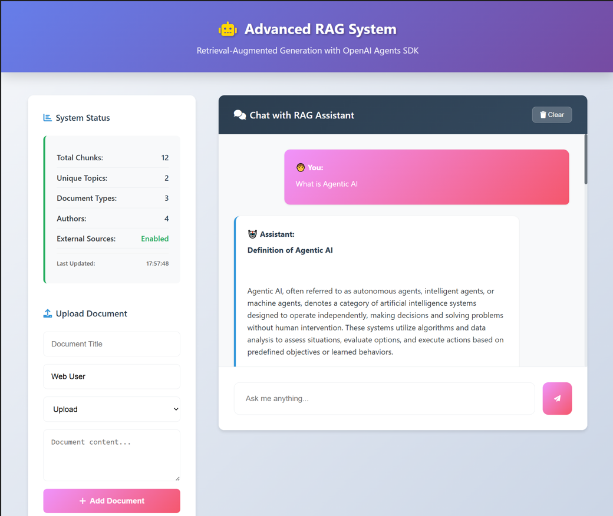

# Advanced RAG System with OpenAI Agents SDK

A comprehensive Retrieval-Augmented Generation (RAG) system built with OpenAI's Agents SDK, featuring intelligent document retrieval, semantic search, automatic memory management, and a modern web interface powered by FastAPI.



## Features

### Core RAG Capabilities

- **Advanced Document Embedding**: Using OpenAI's `text-embedding-3-small` model
- **Semantic Search**: ChromaDB-powered vector similarity search with advanced ranking
- **Contextual Prompt Generation**: Intelligent context assembly for LLM queries
- **Multi-source Retrieval**: Combines local knowledge base with external content

### OpenAI Agents SDK Integration

- **Agent-based Architecture**: Modular design using OpenAI Agents SDK
- **Tool Integration**: RAG-specific tools for document management and search
- **Conversational Interface**: Natural language interaction with the knowledge base

### Intelligent Memory Management

- **Automatic Updates**: Background content refresh based on usage patterns
- **Search Pattern Learning**: Identifies popular topics for proactive updates
- **Document Change Tracking**: Checksums and versioning for efficient updates
- **Cleanup & Optimization**: Removes outdated content and optimizes storage

### External Content Integration

- **Wikipedia Integration**: Automatic Wikipedia article retrieval
- **Web Scraping**: Abstract web content extraction capabilities
- **Mock API Integration**: Simulated news and research paper fetching
- **Content Aggregation**: Multi-source content compilation

### Web Interface

- **FastAPI Backend**: High-performance REST API with automatic documentation
- **Modern Frontend**: Responsive HTML/CSS/JS interface with real-time features
- **WebSocket Chat**: Real-time conversation with the RAG assistant
- **Document Upload**: Support for multiple file formats via web interface
- **System Analytics**: Live system statistics and health monitoring
- **REST API**: Complete API endpoints for integration with other systems
- **Legacy Streamlit App**: Alternative interface for advanced features

## Quick Start

### Prerequisites

- Python 3.8+
- OpenAI API key

### Installation

1. **Clone the repository**:

   ```bash
   git clone https://github.com/Aishwarya0811/agentic-rag
   cd agentic-rag
   ```
2. **Install dependencies**:

   ```bash
   pip install -r requirements.txt
   ```
3. **Set up environment variables**:
   Create a `.env` file based on `.env.example`:

   ```bash
   cp .env.example .env
   ```

   Edit `.env` and add your OpenAI API key:

   ```
   OPENAI_API_KEY=your_openai_api_key_here
   ```
4. **Run the FastAPI application**:

   ```bash
   python fastapi_app.py
   ```
5. **Access the application**:

   - **Web Interface**: `http://localhost:8000`
   - **API Documentation**: `http://localhost:8000/api/docs`
   - **Alternative Streamlit UI**: `streamlit run streamlit_app.py` → `http://localhost:8501`

## Deployment

### Local Development

```bash
# FastAPI server (recommended)
python fastapi_app.py

# Alternative: Streamlit interface
streamlit run streamlit_app.py --server.port 8501
```

### Production Deployment

For production deployment, consider:

#### FastAPI Production Setup

```bash
# Install production server
pip install gunicorn

# Run with Gunicorn
gunicorn fastapi_app:app -w 4 -k uvicorn.workers.UvicornWorker --bind 0.0.0.0:8000

# Or with Uvicorn
uvicorn fastapi_app:app --host 0.0.0.0 --port 8000 --workers 4
```

#### Docker Deployment

```dockerfile
FROM python:3.9-slim

WORKDIR /app
COPY requirements.txt .
RUN pip install -r requirements.txt

COPY . .
EXPOSE 8000

CMD ["uvicorn", "fastapi_app:app", "--host", "0.0.0.0", "--port", "8000"]
```

#### Production Considerations

- **Environment Variables**: Secure API key storage with proper env management
- **Authentication**: Implement user authentication and authorization
- **HTTPS**: Use reverse proxy (nginx) with SSL certificates
- **Monitoring**: Set up logging, metrics, and health checks
- **Scaling**: Use load balancers and multiple instances
- **Database**: Consider persistent vector store solutions for larger datasets
- **Caching**: Implement Redis caching for improved performance

## Contributing

1. Fork the repository
2. Create a feature branch
3. Make your changes
4. Add tests if applicable
5. Submit a pull request

## License

This project is licensed under the MIT License - see the LICENSE file for details.
